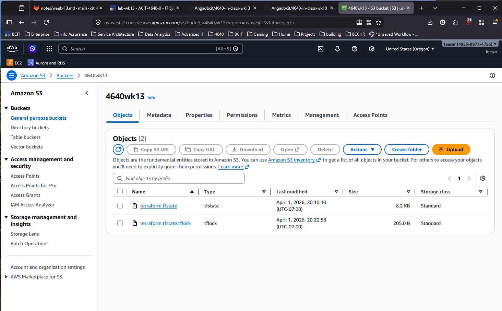

# acit4640-lab-wk13

## Team

- Angad Bains
- Misha Makaroff

## Bucket

The bucket is used for the remote backend for our Terraform configuration. We can create it by simply adding a block in the `provider.tf`.

```hcl
terraform {
    backend "s3" {
        bucket = "4640wk13"
        key = "terraform.tfstate"
        region = "us-west-2"
        encrypt = true
        use_lockfile = true
    }
}
```

## Questions

### When is the state file created?

That object is created when Terraform first performs an operation that writes state, such as a successful `terraform apply`.

### When is the lock file present?

The lock file is present only when Terraform is actively holding a lock. In the S3 backend, locking is enabled with `use_lockfile = true`. Terraform automatically locks state for operations that could write state.

### Is the lock file always in the bucket after it is created?

The lock file is not intended to remain in the bucket permanently. It exists while Terraform is performing a state-changing operation and holding the lock.

## Screenshots

AWS S3 web console that shows the state file only:


AWS S3 web console that shows the lock file and the state file:

