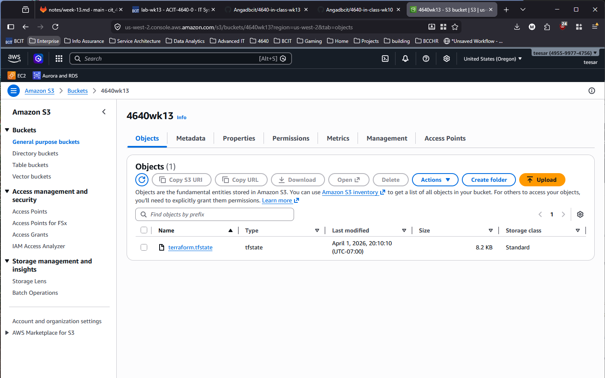

# acit4640-lab-wk13

## Team

- Angad Bains
- Misha Makaroff

## Bucket

The bucket is used for the remote backend for our Terraform configuration. We can create it by simply adding a block in the `provider.tf`.

```hcl
terraform {
    backend "s3" {
        bucket = "4640wk13"
        key = "terraform.tfstate"
        region = "us-west-2"
        encrypt = true
        use_lockfile = true
    }
}
```

## Questions

### When is the state file created?

### When is the lock file present?

### Is the lock file always in the bucket after it is created?

## Screenshots

AWS S3 web console that shows the state file only:


AWS S3 web console that shows the lock file and the state file:

